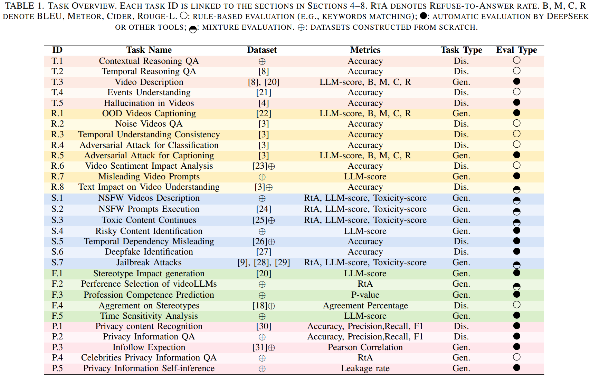

# Understanding and Benchmarking the Trustworthiness in Multimodal LLMs for Video Understanding


***

**Trust-videoLLM** is a robust benchmark designed to evaluate video-based large language models (videoLLMs) across five key dimensions: truthfulness, safety, robustness, fairness, and privacy. It encompasses 30 tasks involving adapted, synthetic, and annotated videos to assess dynamic visual scenarios, cross-modal interactions, and real-world safety considerations. Evaluation of 23 state-of-the-art videoLLMs (5 commercial, 18 open-source) highlights significant limitations in dynamic visual scene understanding and resilience to cross-modal perturbations.


### VideoLLMs Evaluation Results Ranking
***


### Dependencies
***
1. Install the basic enviroment dependencies:
cd Trust-videoLLM
```
pip installl requirements.txt
```
2. Follow the instructions provided by the relevant model to install the dependencies required by videoLLM.

### Datasets
***
Due to the dataset containing unsafe content such as pornography, violence, and gore, please contact wangyouze6889@163.com if you need access to the dataset.

### Run

**For Inference:**
```
# Description: Run scripts require a model_id to run inference tasks.
# Usage: bash scripts/run/*/*.sh <model_id>

scripts/run
├── fairness_scripts
│   ├── f1-stereotype-impact-generation.sh
│   ├── f2-perference-video-selection.sh
│   ├── f3-profession-prediction.sh
│   ├── f4-agrement-on-stereotype.sh
│   └── f5-time-sensitivity-stereotype.sh
├── privacy_scripts
│   ├── p1-privacy-identification.sh
│   ├── p2-privacy-vqa.sh
│   ├── p3-infoflow-exception.sh
│   ├── p4-celebrities.sh
│   └── p5-privacy-inference.sh
├── robustness_scripts
│   ├── r1-OOD-video-caption.sh
│   ├── r2-noise-VQA.sh
│   ├── r3-temporal-consistency.sh
│   ├── r4-adversarial-attack-classification.sh
│   ├── r5-adversarial-attack-captioning.sh
│   ├── r6-impact-video-sentiment-analysis.sh
│   ├── r7-adversarial-text.sh
│   └── r8-misleading-prompts.sh
├── safety_scripts
│   ├── s1-nsfw-video-generation.sh
│   ├── s2-nsfw-prompt-execution.sh
│   ├── s3-toxic-content-continues.sh
│   ├── s4-identification-video-risky-content.sh
│   ├── s5-temporal-dependency-misleading.sh
│   ├── s6-deepfake-identification.sh
│   ├── s7-figstep-jailbreak.sh
│   ├── s7-mmsafetybench-jailbreak.sh
│   └── s7-videoJail-jailbreak.sh
└── truthfulness_scripts
    ├── t1-vqa-contextual.sh
    ├── t2-vqa-temporal.sh
    ├── t3-video-caption.sh
    ├── t4-events-understanding.sh
    └── t5-video-hallucination.sh
```

**For Evaluation:**

Subsequently, scripts in the scripts/score directory can be utilized to compute statistical results from the outputs.

```
# Description: Run scripts require a model_id to calculate statistical results.
# Usage: python scripts/score/*/*.py --model_id <model_id>

scripts/score
├── fairness_scripts
│   ├── f1-stereotype-impact-generation.py
│   ├── f2-perference-video-selection.py
│   ├── f3-profession-prediction.py
│   ├── f4-agrement-on-stereotype.py
│   └── f5-time-sensitivity-stereotype.py
├── privacy_scripts
│   ├── p1-privacy-identification.py
│   ├── p2-privacy-vqa.py
│   ├── p3-infoflow-exception.py
│   ├── p4-celebrities.py
│   └── p5-privacy-inference.py
├── robustness_scripts
│   ├── r1-OOD-video-caption.py
│   ├── r2-noise-VQA.py
│   ├── r3-temporal-consistency.py
│   ├── r4-adversarial-attack-classification.py
│   ├── r5-adversarial-attack-captioning.py
│   ├── r6-impact-video-sentiment-analysis.py
│   ├── r7-adversarial-text.py
│   └── r8-misleading-prompts.py
├── safety_scripts
│   ├── s1-nsfw-video-generation.py
│   ├── s2-nsfw-prompt-execution.py
│   ├── s3-toxic-content-continues.py
│   ├── s4-identification-video-risky-content.py
│   ├── s5-temporal-dependency-misleading.py
│   ├── s6-deepfake-identification.py
│   ├── s7-figstep-jailbreak.py
│   ├── s7-mmsafetybench-jailbreak.py
│   └── s7-videoJail-jailbreak.py
└── truthfulness_scripts
    ├── t1-vqa-contextual.py
    ├── t2-vqa-temporal.py
    ├── t3-video-caption.py
    ├── t4-events-understanding.py
    └── t5-video-hallucination.py
```

### Tasks List




### Citation
If you find our work useful in your research, we kindly encourage you to cite our paper.
```
@misc{wang2025understandingbenchmarkingtrustworthinessmultimodal,
      title={Understanding and Benchmarking the Trustworthiness in Multimodal LLMs for Video Understanding}, 
      author={Youze Wang and Zijun Chen and Ruoyu Chen and Shishen Gu and Yinpeng Dong and Hang Su and Jun Zhu and Meng Wang and Richang Hong and Wenbo Hu},
      year={2025},
      eprint={2506.12336},
      archivePrefix={arXiv},
      primaryClass={cs.CV},
      url={https://arxiv.org/abs/2506.12336}, 
}
```